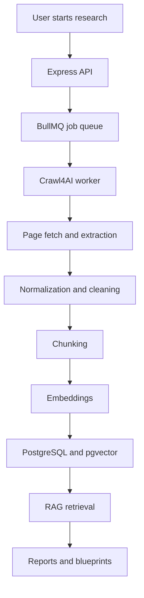
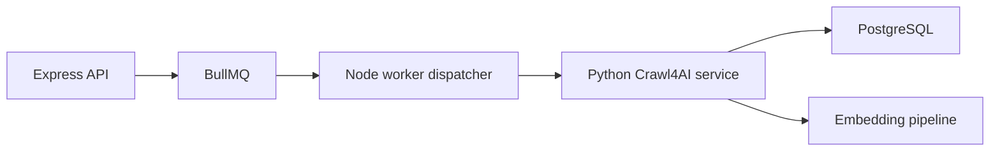

# Implementing Crawl4AI for AI Web Scraping

This guide explains how to implement `Crawl4AI` in the VentureIQ architecture as the primary web scraping and content extraction layer for AI-ready data ingestion.

It is written to fit the current project direction:

- `Express.js` API for orchestration
- background workers for long-running jobs
- `PostgreSQL` + `pgvector` for storage and retrieval
- report and blueprint generation built on grounded source material

---

## 1. What Crawl4AI Should Do in This Project

In this product, `Crawl4AI` should not just fetch HTML. It should become the structured ingestion layer between the public web and your RAG system.

### Main responsibilities

1. Discover and crawl relevant pages from seed URLs or targeted searches.
2. Render modern websites when static HTML is not enough.
3. Extract clean, AI-usable content from noisy pages.
4. Preserve metadata such as URL, title, timestamps, industry, and source type.
5. Produce normalized output that can be chunked, embedded, cited, and reused in reports.
6. Feed downstream systems such as:
   - market trend analysis
   - failure vault indexing
   - report generation
   - blueprint recommendations
   - alerting and monitoring

---

## 2. Recommended Architecture

Use `Crawl4AI` inside the worker layer, not directly in request-response API routes.



### Why this is the right place

- crawling is slow and failure-prone
- sites may rate-limit or block requests
- extraction may require retries and fallbacks
- report generation should depend on persisted, auditable data rather than live scraping

---

## 3. Recommended Project Structure

A clean structure for the scraping pipeline would look like this:

```text
apps/
  server/
    src/
      api/
      services/
      queues/
      workers/
      db/
packages/
  shared/
    src/
      types/
      constants/
  crawler/
    src/
      crawl4ai/
        client.ts
        crawler.ts
        extractors.ts
        normalizers.ts
        policies.ts
        seedUrls.ts
        sourceClassifier.ts
        chunker.ts
        ingestion.ts
```

### Suggested responsibility split

- `client.ts` — wraps Crawl4AI setup and configuration
- `crawler.ts` — runs crawl jobs
- `extractors.ts` — page extraction rules and fallbacks
- `normalizers.ts` — converts raw pages into a consistent document schema
- `policies.ts` — rate limits, allowlists, crawl depth, robots behavior
- `seedUrls.ts` — authoritative source registry for each industry
- `sourceClassifier.ts` — classify documents as trend, failure, legal, news, competitor, etc.
- `chunker.ts` — split clean content for embeddings
- `ingestion.ts` — save sources, chunks, metadata, and lineage into Postgres

---

## 4. Installation Strategy

There are two implementation patterns.

## Option A: Keep your main stack in Node and run Crawl4AI as a separate service

This is usually the best approach if your app is already centered on `TypeScript`, `Express`, and `BullMQ`.

### Why

`Crawl4AI` is commonly used in a Python-centered workflow. Your current architecture is Node-first. The cleanest design is:

- Node API receives the research request
- Node queue schedules a crawl job
- Python-based Crawl4AI worker performs crawl and extraction
- results are sent back to your DB or an internal ingestion endpoint

### Recommended shape



## Option B: Rebuild the scraping worker fully around Python

This can work if you want a Python-heavy ingestion stack, but it creates more cross-language complexity with the rest of your current docs and design.

### Recommendation

For this repository, **Option A is the better fit**.

---

## 5. Implementation Flow

## Step 1: Define the crawl input contract

Every crawl job should receive a strongly typed payload.

### Example payload

```json
{
  "jobId": "job_123",
  "projectId": "proj_123",
  "sessionId": "sess_123",
  "industryId": 14,
  "sourceType": "trend",
  "seedUrls": [
    "https://example.com/market-report",
    "https://example.com/industry-news"
  ],
  "region": "US-NY",
  "depth": "deep",
  "maxPages": 25,
  "includeExternalLinks": false,
  "tags": ["healthcare", "saas", "b2b"]
}
```

### Important fields

- `industryId` — required for downstream tagging
- `sourceType` — trend, failure, legal, competitor, news
- `maxPages` — prevents uncontrolled crawling
- `depth` — shallow, standard, deep
- `region` — useful for localized compliance and regulation scraping

---

## 6. Define a normalized document schema

Do not let each scraped page flow through the system in its own custom shape. Normalize everything immediately.

### Recommended normalized schema

```ts
export interface CrawledDocument {
  url: string;
  canonicalUrl?: string;
  title: string;
  description?: string;
  contentMarkdown: string;
  contentText: string;
  extractedAt: string;
  publishedAt?: string;
  sourceType: 'trend' | 'failure' | 'legal' | 'news' | 'competitor';
  industryId: number;
  region?: string;
  language?: string;
  author?: string;
  siteName?: string;
  confidenceScore?: number;
  tags: string[];
  metadata: Record<string, unknown>;
}
```

### Why this matters

Your downstream systems such as chunking, citation rendering, and report generation should all operate on this single schema.

---

## 7. Crawl4AI service design

Create a dedicated internal service for crawling.

## Example service responsibilities

1. Accept a crawl payload.
2. Run Crawl4AI against each seed URL.
3. Extract clean Markdown and plain text.
4. Remove boilerplate and navigation noise.
5. Return normalized documents.
6. Save crawl execution metadata.

### Internal service endpoints

If you expose Crawl4AI internally, use routes such as:

- `POST /internal/crawl/jobs`
- `GET /internal/crawl/jobs/:jobId`
- `POST /internal/crawl/extract`
- `POST /internal/crawl/retry/:jobId`

These should be internal-only, not public-facing APIs.

---

## 8. Node orchestration flow

In your current architecture, the Express API should trigger research and enqueue jobs.

### Suggested flow

1. User completes interview.
2. API calls `POST /api/v1/research/trigger`.
3. Server creates a BullMQ job.
4. Worker prepares seed URLs and crawl config.
5. Worker calls the Crawl4AI service.
6. Crawl4AI returns extracted documents.
7. Node pipeline classifies, chunks, embeds, and stores the output.
8. Report and blueprint services query the stored data.

### Pseudocode

```ts
async function processResearchJob(job: ResearchJob) {
  const crawlPayload = buildCrawlPayload(job);

  const documents = await crawlService.run(crawlPayload);

  const normalized = documents.map(normalizeDocument);
  const classified = normalized.map(classifySourceType);
  const chunks = classified.flatMap(chunkDocument);

  await saveSources(classified);
  await saveChunks(chunks);
  await embedAndStore(chunks);
  await updateResearchJobStatus(job.id, 'completed');
}
```

---

## 9. Extraction strategy with Crawl4AI

Your extraction logic should target AI-readable content, not pixel-perfect page reproduction.

### Extraction priorities

1. Main article/report body
2. Headings and section hierarchy
3. Lists and tables when possible
4. Published date and author
5. Outbound citations or referenced links

### Remove

- navbars
- footers
- cookie banners
- ads
- unrelated sidebars
- repeated boilerplate

### Output formats to keep

- `markdown` for report reuse and citations
- `plain text` for chunking and embeddings
- structured metadata for filtering and governance

---

## 10. Classify source types after crawling

After extracting a page, assign a business meaning to it.

### Example source categories

- `trend`
- `failure`
- `legal`
- `news`
- `competitor`
- `market-report`
- `pricing`

### Classification inputs

- URL domain
- page title
- extracted headings
- keywords
- industry seed configuration
- optional LLM classifier for ambiguous sources

### Rule-first, LLM-second

Prefer deterministic rules first. Use an LLM only when the source cannot be confidently classified.

---

## 11. Seed URL strategy

Do not crawl the open web blindly.

Maintain curated seed URLs for each industry in a shared config.

### Example structure

```ts
export const industrySeedUrls = {
  14: {
    name: 'Technology',
    trend: [
      'https://techcrunch.com',
      'https://www.gartner.com'
    ],
    legal: [
      'https://www.ftc.gov'
    ],
    failure: [
      'https://www.failory.com'
    ]
  }
};
```

### Best practice

Store this in:

- config files for local development
- database-backed admin-managed seed URL tables for production

That aligns with your existing admin API design.

---

## 12. Chunking and embeddings

Once Crawl4AI returns clean content, pass it through a chunking pipeline.

### Recommended chunking rules

- chunk by headings first
- keep chunks semantically coherent
- target 500 to 1200 tokens per chunk
- preserve source URL and heading path
- record chunk position in the original document

### Example chunk metadata

```json
{
  "sourceUrl": "https://example.com/article",
  "industryId": 14,
  "sourceType": "trend",
  "headingPath": ["Market Outlook", "AI Adoption"],
  "chunkIndex": 3,
  "publishedAt": "2026-08-01T00:00:00Z"
}
```

This makes your report citations and traceability much better.

---

## 13. Database storage design

Use at least two storage layers:

1. **source record**
2. **embedded chunk record**

### Suggested tables

#### `knowledge_sources`
- `id`
- `url`
- `canonical_url`
- `title`
- `source_type`
- `industry_id`
- `region`
- `site_name`
- `published_at`
- `scraped_at`
- `content_markdown`
- `content_text`
- `metadata`
- `checksum`

#### `vector_embeddings`
- `id`
- `source_id`
- `chunk_content`
- `embedding`
- `metadata`

### Optional but useful

#### `crawl_jobs`
- job execution state
- pages attempted
- pages succeeded
- pages failed
- retry count
- failure reason

#### `crawl_documents`
- one row per crawled page before chunking
- useful for debugging and auditability

---

## 14. Freshness and recrawl policy

Some sources age quickly. Others do not.

### Suggested recrawl windows

- `news` — every 6 to 24 hours
- `trend` — daily or every few days
- `legal` — daily for volatile industries, weekly otherwise
- `failure` — weekly
- `market-report` — weekly or monthly

### Recrawl triggers

- report generation requests
- user watchlists
- stale source thresholds
- manual admin refresh
- failed prior crawl recovery

---

## 15. Anti-blocking and crawl safety

Crawl4AI is not a license to scrape irresponsibly.

### Minimum protections

- respect `robots.txt` where required by your policy
- set per-domain concurrency limits
- add retry with backoff
- rotate user agents
- use proxies where necessary
- maintain domain allowlists/blocklists
- enforce crawl timeouts
- cap max pages per job

### Important note

For regulated, high-value, or aggressively protected sites, you may still need:

- premium proxies
- special extraction logic
- legal review
- alternative licensed data access

---

## 16. Data quality checks

Every crawled result should be validated before embedding.

### Reject documents when

- extracted text is too short
- page is mostly navigation or boilerplate
- duplicate checksum already exists
- crawl returned blocked or challenge content
- language is unsupported
- confidence score is below threshold

### Add quality metrics

- extraction length
- duplicate ratio
- structured section count
- citation density
- freshness age
- classification confidence

These metrics should feed your `/api/v1/analytics/data-quality` endpoint.

---

## 17. How Crawl4AI fits your existing APIs

Your current API docs already support this well.

### Best endpoint mapping

- `POST /api/v1/research/trigger` — starts Crawl4AI-driven research
- `GET /api/v1/research/status/:jobId` — tracks crawl and ingestion progress
- `GET /api/v1/research/results/:jobId/sources` — lists crawled sources
- `GET /api/v1/data/sources` — exposes normalized source inventory
- `GET /api/v1/data/sources/:id/content` — returns cleaned source content
- `GET /api/v1/data/coverage` — shows where Crawl4AI has or lacks data
- `GET /api/v1/reports/:reportId/citations` — links generated output back to crawled material

So the missing piece is mostly **worker implementation**, not API design.

---

## 18. Example end-to-end workflow

### Market report workflow

1. User asks for a market-entry report in Technology.
2. Server creates a research job.
3. Worker loads seed URLs for Technology plus region-specific legal sources.
4. Crawl4AI crawls and extracts clean documents.
5. Documents are normalized and classified.
6. Text is chunked and embedded into `pgvector`.
7. Report generator queries the vector store plus structured filters.
8. Final report includes citations back to original source URLs.

---

## 19. Practical implementation order

Do this in phases.

### Phase 1: Basic ingestion

- set up a Crawl4AI service
- crawl a single URL
- extract clean text and Markdown
- save source records in Postgres

### Phase 2: RAG integration

- chunk extracted content
- generate embeddings
- store vectors in `pgvector`
- build filtered retrieval by industry and source type

### Phase 3: Production hardening

- add retries and backoff
- add duplicate detection
- add recrawl policy
- add domain policies and proxy support
- add audit and data quality metrics

### Phase 4: Report optimization

- attach citation lineage
- section-aware chunking
- freshness scoring
- competitor and regulation-specific crawlers

---

## 20. Recommended implementation decision for this repo

Based on your current documentation, the strongest design is:

- keep the public API and orchestration in `Express.js`
- keep job scheduling in `BullMQ`
- run `Crawl4AI` in a dedicated worker or sidecar service
- normalize results into `knowledge_sources`
- embed cleaned chunks into `pgvector`
- build reports only from persisted, auditable source data

That gives you:

- cleaner architecture
- easier retries
- better report traceability
- lower hallucination risk
- better scaling for the 16-industry model

---

## 21. Common mistakes to avoid

- scraping directly inside API request handlers
- embedding raw HTML instead of cleaned text
- skipping source metadata and lineage
- not limiting crawl depth or page count
- using an LLM for every classification when rules would work
- generating reports from live crawl results before persistence
- failing to deduplicate repeated pages
- mixing user-uploaded files and web sources without source labels

---

## 22. Final recommendation

If your goal is **AI web scraping for grounded reports and market intelligence**, implement Crawl4AI as a **specialized ingestion service** in the worker layer, not as a frontend-facing feature.

The ideal pipeline is:

1. `research/trigger`
2. worker job
3. Crawl4AI crawl and extraction
4. normalization
5. classification
6. chunking
7. embeddings
8. `pgvector` storage
9. report generation with citations

That is the cleanest way to make Crawl4AI useful in this project.
