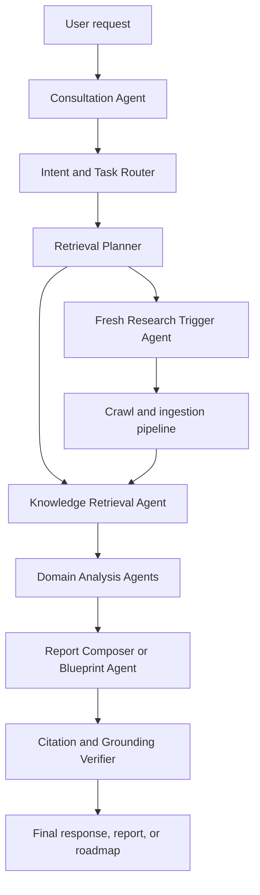
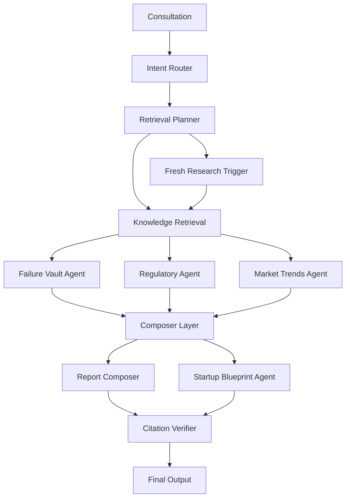

# Proper RAG Agents for This Application

This guide defines the right Retrieval-Augmented Generation agent architecture for VentureIQ AI.

The application is not a generic chatbot. It is a **market intelligence, report generation, startup planning, and monitoring system** across 16 industries. Because of that, the RAG layer should be built as a **small set of specialized agents** with clear responsibilities instead of one giant all-purpose agent.

---

## 1. Core Principle

Do **not** build one monolithic "AI agent" that tries to:

- interview the user
- search the database
- decide whether to scrape
- analyze failures
- analyze regulations
- generate reports
- generate blueprints
- verify citations

That usually becomes brittle, expensive, and hard to debug.

### Better approach

Use a **coordinated multi-agent RAG system** where each agent has one focused job.

For this application, the correct design is:

1. **Consultation Agent**
2. **Intent and Task Router Agent**
3. **Retrieval Planner Agent**
4. **Knowledge Retrieval Agent**
5. **Fresh Research Trigger Agent**
6. **Failure Vault Agent**
7. **Regulatory Intelligence Agent**
8. **Competitor and Market Trends Agent**
9. **Report Composer Agent**
10. **Startup Blueprint Agent**
11. **Citation and Grounding Verifier Agent**
12. **Monitoring and Alert Agent**

That is enough specialization without becoming over-engineered.

---

## 2. Recommended High-Level Flow



This lets your system choose between:

- using existing knowledge
- running fresh research
- combining both

---

## 3. The Agents You Actually Need

## 3.1 Consultation Agent

### Purpose

Drive the interactive discovery flow with the founder.

### Responsibilities

- ask clarifying questions
- capture user goals, budget, timeline, region, team, and skill level
- maintain context over the session
- summarize collected requirements into structured form

### Inputs

- live user chat messages
- session history
- profile data

### Outputs

```json
{
  "industryId": 14,
  "businessModel": "B2B SaaS",
  "targetRegion": "US-NY",
  "budget": 50000,
  "timeline": "6 months",
  "goals": ["launch MVP", "find market gap"],
  "unknowns": ["regulatory constraints", "pricing model"]
}
```

### Important note

This agent should **not** perform retrieval itself. It should gather inputs cleanly.

---

## 3.2 Intent and Task Router Agent

### Purpose

Decide what kind of workflow the user actually needs.

### Example intents

- startup blueprint creation
- market-entry report generation
- competitor intelligence
- risk analysis
- regulation lookup
- marketing playbook generation
- update existing blueprint
- watchlist monitoring

### Responsibilities

- classify the request
- choose the correct downstream agents
- detect when live research is required
- detect when existing RAG data is sufficient

### Example routing decisions

- "Show me startup risks in New York telehealth" → Regulatory + Failure Vault + Report path
- "Create my startup roadmap" → Consultation + Retrieval + Blueprint path
- "Give me latest competitor trends" → Retrieval + Market Trends + possibly fresh crawl

This agent is the traffic controller.

---

## 3.3 Retrieval Planner Agent

### Purpose

Convert the user task into a retrieval strategy.

### Responsibilities

- decide which corpora to query
- choose filters such as industry, region, freshness window, and source type
- choose retrieval depth
- decide whether hybrid search is enough or if fresh crawling is needed

### Corpora it may choose from

- trend knowledge
- failure vault
- legal and regulation sources
- competitor intelligence
- user-uploaded files
- prior generated reports
- session memory

### Example output

```json
{
  "collections": ["trends", "legal", "failures"],
  "industryId": 14,
  "region": "US-NY",
  "sourceTypes": ["trend", "legal", "failure"],
  "freshnessWindowHours": 72,
  "topK": 25,
  "rerank": true,
  "needsFreshResearch": true
}
```

### Why this should be its own agent

Because planning retrieval is not the same as generating an answer. Keeping them separate improves traceability and quality.

---

## 3.4 Knowledge Retrieval Agent

### Purpose

Execute retrieval against the existing database.

### Responsibilities

- run vector search
- run keyword/full-text search
- merge, deduplicate, and rank results
- retrieve chunk text, metadata, and source lineage
- return a grounded context package for downstream agents

### It should query

- `knowledge_sources`
- `vector_embeddings`
- failure and regulation subsets
- uploaded user documents where relevant

### Output shape

```json
{
  "chunks": [
    {
      "chunkId": "chunk_1",
      "sourceId": "src_1",
      "text": "...",
      "sourceType": "legal",
      "industryId": 14,
      "score": 0.91,
      "url": "https://example.com"
    }
  ],
  "coverage": {
    "trend": 8,
    "legal": 6,
    "failure": 4
  }
}
```

### Important note

This agent should be **tool-driven**, not open-ended. It should call retrieval tools and return evidence, not write business advice.

---

## 3.5 Fresh Research Trigger Agent

### Purpose

Determine and initiate when new web research is required.

### Trigger conditions

- low retrieval coverage
- stale source data
- no relevant regulation results in target region
- competitor data too old
- user explicitly asks for latest data

### Responsibilities

- detect freshness gaps
- create a research plan
- trigger `POST /api/v1/research/trigger`
- wait for or later consume the research results

### Important constraint

This agent should not crawl directly. It should trigger the ingestion pipeline described in `Crawl4AIImplementation.md`.

---

## 3.6 Failure Vault Agent

### Purpose

Specialized reasoning over startup failures, risks, and warning signs.

### Responsibilities

- retrieve failure post-mortems
- identify recurring root causes
- map failure patterns to the user's business idea
- produce cautionary insights and mitigation recommendations

### Why it should be separate

Failure analysis is a different reasoning task than trend analysis. You want a focused agent that looks for:

- avoidable mistakes
- oversaturation
- timing risk
- founder capability gaps
- operational risk
- regulatory failure risk

### Typical outputs

- top risk themes
- likely failure scenarios
- mitigation checklist
- confidence level by evidence strength

---

## 3.7 Regulatory Intelligence Agent

### Purpose

Handle compliance and legal/regulatory intelligence.

### Responsibilities

- retrieve regulations by industry and region
- summarize licensing or legal obligations
- identify ambiguous or missing regulatory information
- clearly separate factual citations from non-legal interpretation

### Important safety rule

This agent must be conservative.

It should:

- cite sources clearly
- avoid pretending to provide legal advice
- mark uncertain or incomplete areas
- escalate low-confidence areas to manual review language

This is one of the highest-risk parts of the application.

---

## 3.8 Competitor and Market Trends Agent

### Purpose

Analyze market movement, demand signals, pricing patterns, and competitor activity.

### Responsibilities

- synthesize trends across sources
- compare competitors
- identify underserved segments
- detect trend acceleration or decline
- highlight actionable opportunities

### Useful report outputs

- market momentum summary
- competitor landscape snapshot
- trend change timeline
- opportunity gaps
- pricing and messaging patterns

This agent is especially important for your report endpoints and dashboard analytics.

---

## 3.9 Report Composer Agent

### Purpose

Build structured reports from grounded evidence.

### Responsibilities

- assemble report sections in the right order
- transform evidence into market analysis, risk analysis, regulatory analysis, and recommendations
- keep sections internally consistent
- request missing evidence if coverage is weak
- output both readable narrative and structured report data

### It should generate

- executive summary
- market analysis
- competitor analysis
- risk analysis
- regulatory analysis
- financial benchmarks
- marketing analysis
- recommendations

### Important constraint

This agent should only generate from retrieved, cited material. It should not invent unsupported figures or claims.

---

## 3.10 Startup Blueprint Agent

### Purpose

Convert retrieved intelligence into a step-by-step startup roadmap.

### Responsibilities

- map research findings into phased execution steps
- adapt steps to budget, location, skills, and urgency
- define success criteria for each step
- attach relevant evidence and warnings to steps

### Example outputs

- five-phase roadmap
- legal checklist
- milestone plan
- dependency sequence
- resource recommendations

### Why separate from Report Composer

Reports explain the market.
Blueprints turn evidence into action.
Those are related, but not identical, tasks.

---

## 3.11 Citation and Grounding Verifier Agent

### Purpose
n
Check that outputs are actually supported by retrieved evidence.

### Responsibilities

- verify each major claim is backed by at least one source
- ensure citations point to valid source records
- flag unsupported statements
- request regeneration or revision when evidence is weak
- downgrade confidence when coverage is thin

### This agent is critical

Given the app's business and regulatory focus, this agent should be mandatory for:

- reports
- legal sections
- failure analysis
- startup blueprint recommendations

### Example checks

- does the market growth claim appear in a cited source?
- does the licensing requirement come from a legal or official source?
- does the competitor claim use fresh enough evidence?

---

## 3.12 Monitoring and Alert Agent

### Purpose

Continuously watch for updates that affect saved projects, reports, or blueprints.

### Responsibilities

- monitor watchlists
- detect fresh regulatory or trend changes
- compare new information against user-owned blueprints
- generate alert summaries
- trigger partial report refreshes when needed

### Examples

- regulation changed in target region
- competitor pricing shifted significantly
- trend the founder depends on is weakening
- new failure case maps to current blueprint step

This agent is not part of the live chat loop. It is a background intelligence agent.

---

## 4. Recommended Orchestration Model

Use `LangGraph.js` or a similar graph-based orchestration layer.

### Why graph orchestration fits

This application has branching decisions:

- use existing knowledge vs trigger fresh research
- report flow vs blueprint flow
- regulatory path vs marketing path
- retry retrieval when coverage is poor
- verification loop before final output

A graph is better than a single linear chain.

### Recommended orchestration graph



---

## 5. Best Agent Groupings for This App

You do not always need all agents for every request.

## 5.1 Report workflow

Use:

- Consultation Agent
- Intent Router Agent
- Retrieval Planner Agent
- Knowledge Retrieval Agent
- Failure Vault Agent
- Regulatory Intelligence Agent
- Competitor and Market Trends Agent
- Report Composer Agent
- Citation and Grounding Verifier Agent

## 5.2 Startup blueprint workflow

Use:

- Consultation Agent
- Intent Router Agent
- Retrieval Planner Agent
- Knowledge Retrieval Agent
- Failure Vault Agent
- Regulatory Intelligence Agent
- Startup Blueprint Agent
- Citation and Grounding Verifier Agent

## 5.3 Marketing playbook workflow

Use:

- Consultation Agent
- Intent Router Agent
- Retrieval Planner Agent
- Knowledge Retrieval Agent
- Competitor and Market Trends Agent
- Report Composer Agent or dedicated Marketing Playbook Agent
- Citation and Grounding Verifier Agent

## 5.4 Background monitoring workflow

Use:

- Monitoring and Alert Agent
- Fresh Research Trigger Agent
- Knowledge Retrieval Agent
- Regulatory Intelligence Agent
- Competitor and Market Trends Agent

---

## 6. Tools Each Agent Should Be Allowed to Use

This is important. Do not give every agent every tool.

## Consultation Agent

Allowed:

- session history
- user profile
- project state

Not allowed:

- direct crawl trigger
- unrestricted report generation

## Intent Router Agent

Allowed:

- session summary
- request metadata
- route definitions

## Retrieval Planner Agent

Allowed:

- schema of available corpora
- freshness stats
- data coverage metrics

## Knowledge Retrieval Agent

Allowed:

- knowledge search endpoints
- chunk lookup endpoints
- source metadata endpoints
- coverage endpoints

## Fresh Research Trigger Agent

Allowed:

- coverage endpoints
- freshness endpoints
- research trigger endpoint
- job status endpoint

## Report Composer Agent

Allowed:

- grounded context package
- report template definition
- section requirements

Not allowed:

- raw unrestricted web search

## Citation Verifier Agent

Allowed:

- final draft
- citations
- chunk-source lineage

This separation prevents messy behavior and reduces hallucination risk.

---

## 7. Proper Memory Design

Use three kinds of memory.

## 7.1 Session memory

Used by the Consultation Agent.

Stores:

- user answers
- unresolved questions
- session summaries

## 7.2 Retrieval memory

Used by retrieval and composition agents.

Stores:

- previously selected chunks
- reranking results
- search plans
- coverage gaps

## 7.3 Project memory

Used across long-lived workflows.

Stores:

- generated reports
- blueprints
- user preferences
- watchlists
- previous research results

### Important note

Do not confuse conversation memory with knowledge memory.
Those should be stored separately.

---

## 8. Retrieval Strategy That Fits This Product

This app needs **hybrid, filtered, multi-corpus retrieval**.

### Retrieval order

1. identify the task type
2. identify required corpora
3. filter by industry
4. filter by region if relevant
5. filter by source type
6. filter by freshness window
7. run hybrid retrieval
8. rerank by relevance and authority
9. verify coverage before generation

### Ranking factors

- semantic similarity
- keyword match
- source authority
- freshness
- source type priority
- regulatory trust level
- competitor relevance

This is much better than a naive top-5 vector search.

---

## 9. Confidence and Escalation Rules

Every agent should emit confidence signals.

### Example

```json
{
  "confidence": 0.78,
  "coverage": {
    "trend": "good",
    "legal": "weak",
    "failure": "moderate"
  },
  "needsFreshResearch": true,
  "needsHumanReview": false
}
```

### When to force another step

- insufficient legal evidence
- competitor sources too stale
- too few citations
- conflicting evidence across sources
- high-risk recommendation with low support

This is especially important for reports and legal sections.

---

## 10. Anti-Hallucination Guardrails

For this application, these should be mandatory:

1. no major claim without evidence
2. no legal claims without official or high-trust sources
3. no market size numbers without citation
4. no competitor assertions without dated source support
5. no blueprint step that contradicts retrieved regulatory constraints
6. regenerate sections that fail grounding verification

---

## 11. Mapping to Your Existing API Design

Your current APIs already align well with this architecture.

### Best endpoint mapping

#### Consultation Agent
- `POST /api/v1/sessions`
- `POST /api/v1/sessions/:id/messages`
- `POST /api/v1/sessions/:id/summarize`

#### Retrieval and planning
- `GET /api/v1/knowledge/search`
- `POST /api/v1/knowledge/search`
- `GET /api/v1/data/coverage`
- `GET /api/v1/data/freshness`

#### Fresh research
- `POST /api/v1/research/trigger`
- `GET /api/v1/research/status/:jobId`
- `GET /api/v1/research/results/:jobId/sources`

#### Reports
- `POST /api/v1/reports`
- `GET /api/v1/reports/:reportId/data`
- `GET /api/v1/reports/:reportId/citations`

#### Monitoring
- `GET /api/v1/watchlists`
- `POST /api/v1/alerts`
- `GET /api/v1/watchlists/:id/events`

So the main missing part is **agent orchestration and contracts**, not endpoint scope.

---

## 12. What Not to Do

Avoid these designs:

- one giant agent with every tool
- direct web scraping from the answer-generation agent
- report generation without citation verification
- mixing legal and trend reasoning into one opaque prompt
- skipping retrieval planning
- using only semantic search with no keyword or freshness filters
- letting marketing outputs ignore regulatory findings

Those designs tend to look good in demos and fail in production.

---

## 13. Best Practical Implementation for This Repo

If you want a realistic first version, start with these **7 agents** instead of all 12:

1. Consultation Agent
2. Intent and Task Router Agent
3. Retrieval Planner Agent
4. Knowledge Retrieval Agent
5. Fresh Research Trigger Agent
6. Report Composer Agent
7. Citation and Grounding Verifier Agent

Then add specialized domain agents next:

8. Failure Vault Agent
9. Regulatory Intelligence Agent
10. Competitor and Market Trends Agent
11. Startup Blueprint Agent
12. Monitoring and Alert Agent

### Why this rollout works

It gives you:

- fast first implementation
- strong report quality early
- lower complexity
- room to specialize later

---

## 14. Final Recommendation

The proper RAG agent architecture for this application is a **specialized multi-agent system** centered on:

- retrieval planning
- grounded knowledge retrieval
- domain-specific analysis
- report and blueprint composition
- mandatory citation verification

If I had to choose the most important agents for this product, they would be:

1. **Retrieval Planner Agent**
2. **Knowledge Retrieval Agent**
3. **Report Composer Agent**
4. **Citation and Grounding Verifier Agent**
5. **Regulatory Intelligence Agent**
6. **Failure Vault Agent**

Those six define the real quality bar of VentureIQ.

Everything else improves workflow, usability, and automation around them.
