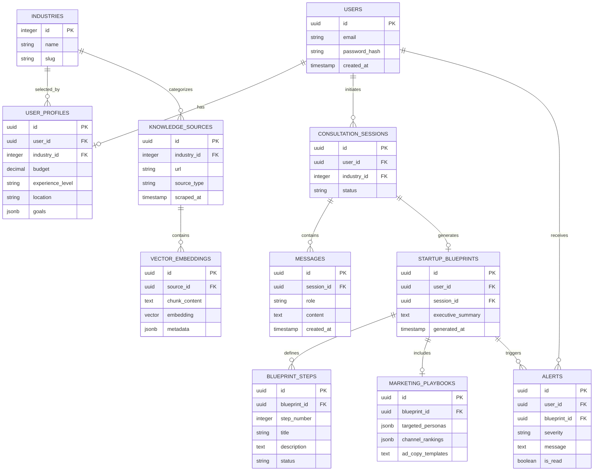

# Relational Database Design

## 1. Relationship Diagram



---

## 2. Data Logic

### A. Knowledge Supply Chain

A single source such as a PDF or industry article is broken into many chunks in `VECTOR_EMBEDDINGS`. When a user asks a question, the system queries the `embedding` column with cosine similarity and filters by relevant `industry_id` metadata.

### B. Interview Memory

All AI and user dialogue is stored in `CONSULTATION_SESSIONS` and `MESSAGES`. This allows the system to remember details such as the user's budget or preferred business model when generating `BLUEPRINT_STEPS`.

### C. Execution Engine

`BLUEPRINT_STEPS` turns AI advice into a trackable task list. Because each step is linked to a `STARTUP_BLUEPRINT`, users can track progress and the system can trigger `ALERTS` when market conditions change.

### D. Industry Link

`INDUSTRIES` acts as the pivot point for the database. Indexing core records by `industry_id` enables both category-specific retrieval and cross-category analysis.

---

## 3. PostgreSQL and `pgvector` Notes

To enable vector support, run the following SQL:

```sql
CREATE EXTENSION IF NOT EXISTS vector;

CREATE TABLE vector_embeddings (
    id UUID PRIMARY KEY DEFAULT gen_random_uuid(),
    source_id UUID REFERENCES knowledge_sources(id) ON DELETE CASCADE,
    chunk_content TEXT,
    embedding VECTOR(1536),
    metadata JSONB
);

CREATE INDEX ON vector_embeddings USING hnsw (embedding vector_cosine_ops);
```

---

## 4. Why This Schema Works

- **Auditability** — Blueprints can be traced back to their source material.
- **User State** — Profiles allow the system to adapt output to beginner and advanced founders.
- **Scalability** — New categories can be added as rows in `INDUSTRIES` without redesigning the schema.
